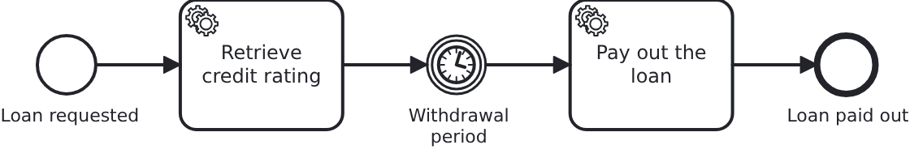

# An idle application

[](./LICENSE)

A workflow application spends most of its life waiting. Waiting used to cost money: the
application asked its database every few seconds whether anything had turned up, all day and
all night, and a database billed by what it does bills for that. Two configuration keys stop
the asking. This blueprint sets them, and it counts the statements so nobody has to take the
saving on trust.

## What this blueprint shows



The loan approval of the base blueprint with one step added: the money is paid out when the
withdrawal period of the contract is over, so the workflow waits in a timer between the
rating and the payment. Thirty seconds here, because the test of this blueprint has to
finish. Two weeks in a real contract, and nothing written below changes with that number.

While the workflow waits, this application sends its database nothing at all.

`vanillabp.outbox.poll-interval` in `application/src/main/resources/application.yaml` is the
first of the two keys. VanillaBP dispatches an outbox entry right after the transaction which
wrote it, and it polls the store as the safety net for what no such notification reached. The
poller waits for the earliest entry which is owed something, and this key says how long it
may wait when nothing is owed at all. Ten seconds is the default, which is 8640 questions a
day about work nobody created. This blueprint sets an hour.

`vanillabp.adapters.camunda7.sleep-until-something-is-due` in
`application/src/main/resources/application-camunda7.yaml` is the second, and it belongs to
the embedded engine. Without it the Camunda 7 job executor asks for work every 5 seconds,
widening to 60 while it finds none. With it, a cycle which found nothing asks once when the
next job is due and waits for that moment, and any transaction which writes a job wakes it
again.

One key without the other buys nothing. Let the engine wait but leave the outbox at its
default, and the database is asked every ten seconds, which is what it was asked before. That
is why this blueprint names both, and why somebody who sets one of them and sees no saving
has not found a broken feature.

### Counting it yourself

`GET /api/loan-approval/statements` returns how many SQL statements the database has been
asked. Open it, wait, open it again, and the difference is what this application costs while
nothing happens.

Measured on this blueprint with both keys set, an application waiting with nothing to do:

```
640 statements so far
... a minute later ...
640 statements so far
```

The same application with the two keys taken out, which is what an application which sets
nothing does:

```
640 statements so far
... a minute later ...
712 statements so far
```

Seventy-two statements a minute is what an application costs which has been idle long enough
for the engine to widen its cycle to the full minute. Right after it did something the same
minute costs more, 167 here in the minute after the loan was paid out, because the engine
starts its backoff at five seconds again. A day of doing nothing is therefore a hundred
thousand statements and upwards, and on a database billed by what it does, every one of them
is paid for.

Almost all of those are the outbox poller rather than the engine: six polls a minute, each
one a select, a delete and the commits around them. The engine's share is one statement a
minute once it has backed off, and the bigger half in the minutes after some work.

The number is the number of lines in `target/loan-approval.trace.db`. H2 writes that file
because the JDBC URL says `TRACE_LEVEL_FILE=2`, one line per statement, and opening it shows
what the database was asked rather than how often. Counting lines in a file costs the
database nothing, so asking does not disturb what it measures. `DatabaseTraffic` is the only
class here which another database would change, and it is measuring equipment rather than
something an application needs.

### Which engine shows which half

The outbox half is the same on every BPMS: it is VanillaBP's own machinery, in the database
of the application.

The engine half exists only where the engine runs inside the application, which of the
supported ones is Camunda 7. A remote BPMS does its polling in its own cluster, so on
Camunda 8 the second key has no place to go and there is nothing of the engine in your
database to save. Running this blueprint with `-Pcamunda8` therefore shows one half, and the
number it prints is the outbox half alone.

## Delta to the base blueprint

Compared to [`module-single`](https://github.com/vanillabp-blueprints/module-single-quarkus):

|            File             |                                    What is different                                    |
|-----------------------------|-----------------------------------------------------------------------------------------|
| `application.yaml`          | `vanillabp.outbox.poll-interval`, and a JDBC URL which has H2 write down its statements |
| `application-camunda7.yaml` | `sleep-until-something-is-due` for the embedded engine                                  |
| `loan_approval.bpmn`        | a timer catch event for the withdrawal period and a service task behind it              |
| `DatabaseTraffic.java`      | counts the statements H2 wrote into its trace file                                      |
| `ApiController.java`        | one more endpoint, which returns that number                                            |
| `WorkflowTaskHandler.java`  | the `@WorkflowTask` method of the task behind the timer                                 |
| `Service.java`              | pays out the loan                                                                       |
| `Aggregate.java`            | `paidOut`                                                                               |
| `LoanApprovalIT.java`       | no statement while the workflow waits, and the workflow going on when the timer is due  |

## Running it

Requires a JDK 21. Camunda 7 is embedded, so nothing else has to run:

```bash
mvn install verify
```

Running it on another BPMS is a Maven profile, not one line of Java changes:

```bash
mvn install verify -Pcamunda8
```

Camunda 8 is a remote engine, so a cluster has to run. Its address, and everything else
specific to that engine, lives in its profile file
`application/src/main/resources/application-camunda8.yaml`, with a copy for the module's own
test:

```yaml
vanillabp:
  adapters:
    camunda8:
      # Camunda 8 is a remote engine: point this at your cluster.
      rest-address: http://localhost:8080
```

That file applies because the Maven profile `camunda8` makes the profile of the same name
the parent of whichever profile the application runs in, so the engine is chosen once, on
the Maven command line, and the build, the tests and the run all follow it. The file with
the engine key of this blueprint, `application-camunda7.yaml`, applies the same way and
only while Camunda 7 is the engine.

Start the application:

```bash
mvn -pl application quarkus:dev
```

The startup says what this application still costs while it is quiet, and it is worth reading
once:

```
'vanillabp.outbox.poll-interval' is PT1H instead of the default PT10S, so an outbox sleeps
until its next entry is due and an application with nothing to do sends it no statement at
all. What is still awake:
- the retention cleanup of the task-delivery records looks once per hour, and only after a
  delivery was recorded, so an application which records nothing does not wake it
- the gauge of the entries waiting in an outbox ('vanillabp.outbox.pending') counts them
  while your monitoring scrapes, at most once per 'vanillabp.metrics.gauge-cache', so a
  dashboard somebody left open keeps that one statement going
...
Camunda7[camunda7]: the job executor sleeps until the next job is due instead of polling
every 5 to 60 seconds, and a transaction which writes a job wakes it. Jobs are acquired by
due date now, which is not the engine's default, so add a database index on the due date of
the ACT_RU_JOB table.
Camunda7[camunda7]: the engine's metrics reporter is switched off. It would have written to
the database every 900 seconds and woken this engine four times an hour.
```

Now walk through it. Start a loan approval, which is the only URL you need:

```
http://localhost:8080/api/loan-approval/start?amount=5000
```

The rating is done at once and then the workflow waits:

```
Loan approval '0f7c…' started
Credit rating of loan approval '0f7c…' is 50
The loan is paid out after the withdrawal period. Until then nothing of this application runs, which this URL shows -> http://localhost:8080/api/loan-approval/statements
```

Thirty seconds later the timer is due and the task behind it runs, which is the half nobody
may trade away for the quiet:

```
Loan approval '0f7c…' was paid out
```

From here the application has nothing left to do. Ask what its database has done so far:

```
http://localhost:8080/api/loan-approval/statements
```

Wait a minute, ask again, and compare the two numbers. The file behind them is
`application/target/loan-approval.trace.db`, and opening it is worth a minute of its own:
every line is one statement, and without the two keys the same handful of them repeats every
ten seconds for as long as the application runs.

Measure after the application has settled rather than in its first minute. A start finishes
for a while after it says it is ready: the schema, the deployment and the first look at the
retention of the delivery records are all work, and counting them as traffic of an idle
application would be counting the wrong thing.

To see the other side, put `poll-interval: PT10S` back into `application.yaml`, set
`sleep-until-something-is-due: false` in `application-camunda7.yaml` and start the
application again. Ask the same question twice a minute apart, and the number grows by what
the two pollers do.

What the application is waiting for is in its own database: the workflow aggregate says how
far the business case has come, and the endpoint above says what the database is being asked
meanwhile.

## How it works

|                                          File                                          |                                    Role                                     |
|----------------------------------------------------------------------------------------|-----------------------------------------------------------------------------|
| `application/src/main/resources/application.yaml`                                      | the cap on how long an outbox poller may wait while nothing is owed         |
| `application/src/main/resources/application-camunda7.yaml`                             | the key which lets the embedded engine wait for the next due job            |
| `loan-approval/src/main/resources/loan-approval/processes/camunda7/loan_approval.bpmn` | the timer the workflow waits in                                             |
| `.../loanapproval/DatabaseTraffic.java`                                                | counts the lines H2 wrote into its trace file, which is measuring equipment |
| `.../loanapproval/ApiController.java`                                                  | the endpoint returning the count                                            |
| `.../loanapproval/WorkflowTaskHandler.java`                                            | the method behind the timer, called when the due date has come              |
| `loan-approval/src/test/.../LoanApprovalIT.java`                                       | the proof: nothing while it waits, and the payment afterwards               |

The saving is a property and a deployment shape rather than a line of code, so there is
almost nothing to read in the Java. What is worth reading is what the two keys do not do.

The cap on the outbox is not a notification between nodes, and nothing in VanillaBP wakes
another node for ordinary work. The node which writes an entry is awake by definition,
because its own commit dispatches it, and a resting node which never hears about that write
loses nothing. What the cap covers is the one case which is left: a node which wrote work
down and then went away before doing it. An hour is a sensible value for that, seconds are
not, and a reader who takes the key for a heartbeat sets it to seconds and gives the whole
saving away.

The engine key has no cap, because the due date answers the question exactly. A job another
application wrote into the same engine is the exception: that commit happens in another
process and reaches nothing here, so two applications on one engine is not a setup this
covers.

Something is still awake, and the startup message says so rather than promising silence. The
retention cleanup of the task delivery records runs once an hour where a delivery was
recorded since the last run. A monitoring system scraping the gauge of the entries waiting in
an outbox asks the database for that number. The engine's own metrics reporter would write
its counters every 900 seconds, which is why it stops writing them where the engine is
allowed to wait; an application which wants them in its database says so with
`db-metrics-reporting: true` and pays four wake-ups an hour for it.

One thing is left to whoever owns the database. Where the engine waits for due dates it also
acquires jobs by due date, and that order wants an index on the due date of `ACT_RU_JOB`. The
startup message asks for it. An in-memory database does not care; a production one does.

The application itself keeps running while it waits. Nothing here makes the process go away,
and what it would take to let a workload of this kind scale down to nothing is a question of
its own.

Telling a quiet application from a stalled one gets harder the longer the pollers rest, and
the metrics are what tells them apart. The wiki page about observability says which counter
answers which question.

## Documentation

- [Observability](https://github.com/vanillabp/adapter-platform-integration/wiki/Observability): what a quiet application looks like from outside, and how to see that it is quiet rather than stuck
- [Running more than one node](https://github.com/vanillabp/adapter-platform-integration/wiki/Running-more-than-one-node): what a second node changes, which is the case the cap on the outbox exists for
- [Quarkus integration](https://github.com/vanillabp/adapter-platform-integration/wiki/Quarkus-integration): the phase-two outbox, its store and its configuration
- [BPMS adapters](https://github.com/vanillabp/adapter-platform-integration/wiki/BPMS-adapters): which engine runs inside the application and which one runs elsewhere
- the wiki of the BPMS adapter you use, for the keys of that engine

This blueprint is developed in the monorepo
[`blueprints`](https://github.com/vanillabp-blueprints/blueprints). This repository is a
read-only mirror, **issues and pull requests belong there.**

## Noteworthy & Contributors

[VanillaBP](https://www.github.com/vanillabp/spi-for-java) was developed by [Phactum](https://www.phactum.at) with the
intention of giving back to the community as it has benefited the community in the past.


## License

Copyright 2026 Phactum Softwareentwicklung GmbH

Licensed under the Apache License, Version 2.0
